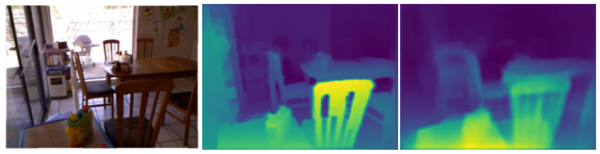
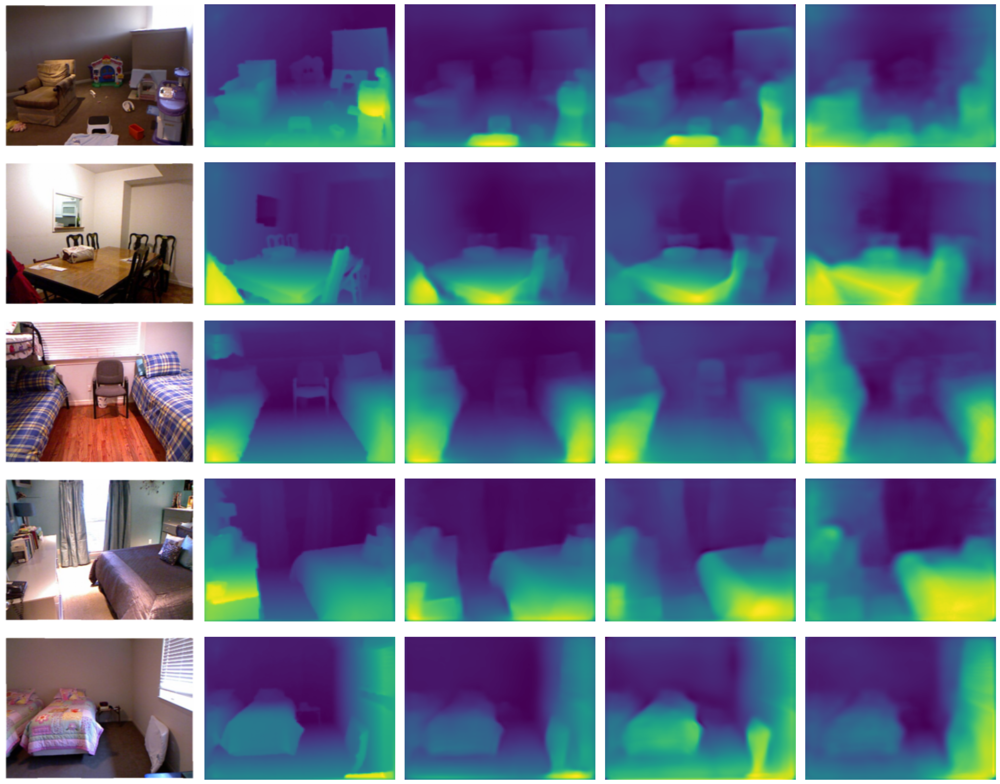

# Estimativa Monocular de Profundidade

Repositório do projeto **"Análise Comparativa na Estimativa Monocular de Profundidade"**, desenvolvido no Centro de Informática da UFPE. O objetivo é comparar diferentes arquiteturas de redes neurais para estimativa de mapas de profundidade a partir de imagens RGB, equilibrando **precisão, preservação de detalhes e eficiência computacional**.

Exemplo de inferência do modelo baseado no SwinV2-T:

* Imagem RGB do conjunto de dados NYU Depth V2
* Mapa de profundidade real (ground truth)
* Mapa de profundidade estimado pelo modelo

---

## Arquiteturas Avaliadas

- **DenseNet-169**: Encoder convolucional com skip connections, bom para preservação estrutural.  
- **Swin Transformer V2-Tiny (SwinV2-T)**: Vision Transformer com decoder convolucional, destaque na fidelidade visual e contornos finos.  
- **MobileNetV2**: Arquitetura leve e eficiente, indicada para dispositivos com restrições de hardware.

---

## Dataset

- **NYU Depth v2** (subconjunto de 1.449 amostras)  
- Pares de imagens **RGB** e **mapas de profundidade**  
- Pré-processamento: redimensionamento para 320×240 pixels e normalização

---

## Metodologia

- Mapas de profundidade invertidos para balancear regiões próximas e distantes  
- Função de perda combinando L1, gradiente, SSIM, Laplace e Scharr  
- Métricas: Rel, RMSE, ALE, EPI e F1-Score  
- Otimização de hiperparâmetros via **Bayesian Optimization**  

---

## Resultados Principais

| Modelo       | Rel ↓    | RMSE ↓   | F1-Score ↑   | Inferências/s |
|-------------|--------|--------|------------|---------------|
| SwinV2-T    | 0.3383 | 0.0974 | 0.2570     | 3.90          |
| DenseNet-169| 0.3900 | 0.1041 | 0.1377     | 2.23          |
| MobileNetV2 | 0.3921 | 0.1052 | 0.0928     | 7.29          |

- **SwinV2-T**: melhor preservação de bordas e detalhes finos  
- **DenseNet-169**: boa fidelidade estrutural, bordas menos nítidas  
- **MobileNetV2**: mais rápido e leve, ideal para dispositivos embarcados

Comparação visual entre as previsões geradas pelos modelos avaliados. Da esquerda para a direita: imagem RGB de entrada, mapa de profundidade real (Ground Truth) e estimativas produzidas pelos modelos baseados em SwinV2-T, DenseNet-169 e MobileNetV2, respectivamente

---

## Referências

1. Bochkovskii, Aleksei, et al. "Depth Pro" (2024)  
2. Alhashim, I., Wonka, P. "High quality monocular depth estimation" (2018)  
3. Liu, Z., et al. "Swin Transformer" (CVPR 2021)  
4. Huang, G., et al. "DenseNet" (CVPR 2017)  
5. Howard, A.G., et al. "MobileNet" (2017)  
6. Silberman, N., et al. "NYU Depth v2" (ECCV 2012)  

## Autores

1. Aline Marianna 
2. Ítalo Silva
3. Lucas Vidal

